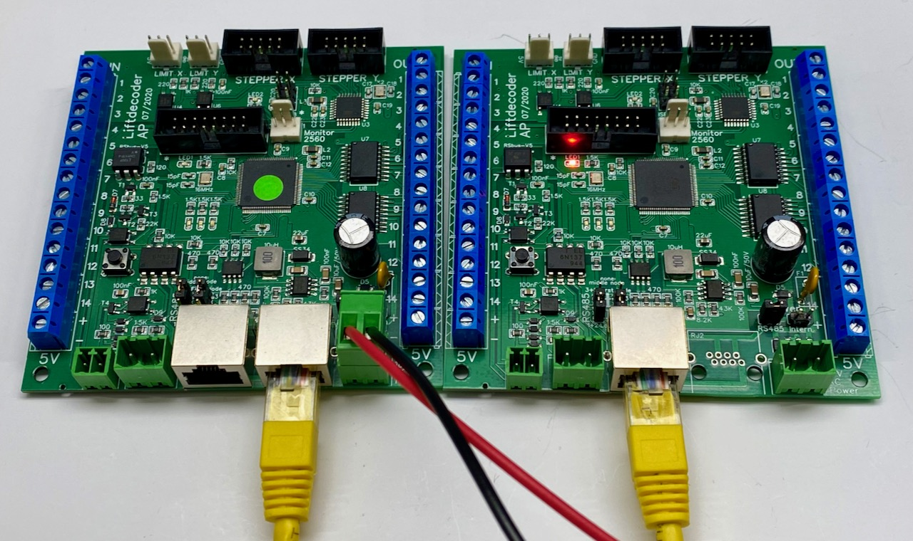

## Power the board

The goal of this step is to test if the power electronics (step-down converter) works well.

Connect a power supply to the connector labelled **18V AC Power**. The power supply should deliver anything between 8 and 24V; a DC power supply should also work. In addition, connect the jumper "intern", to ensure the external power is used internally for the board. 

Next you may check if the power is indeed 5V. Connect a voltmeter to (for example) the blue connectors labelled **5V +** and **5V -**. The voltmeter should show (around) 5Volt.

The second jumper called **RS-485** forwards the incoming power additionally over the "RS-485 bus" towards possible additional lift decoder boards (which can be used to control the button and/or IR-Sensors). The goal of this is to simplify the wiring of the power towards multiple boards. These additional boards receive their power via a network cable, connected to the the RJ45 connector (see below).

The additional boards should also have the jumper **RS-485** installed, to ensure that the power that comes in via the network cable gets forwarded to the onboard step-down converter. It is recommended to check also the step-down converters on the other boards for 5V.

For clarity, the figure below shows the part of the board's schematics that shows the power jumpers. 

