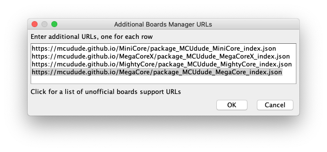
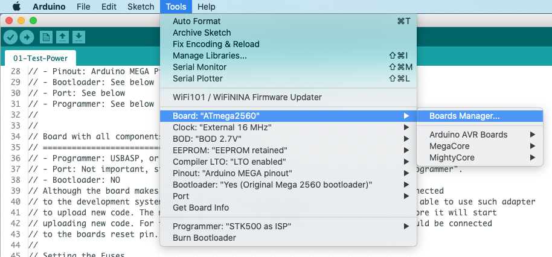
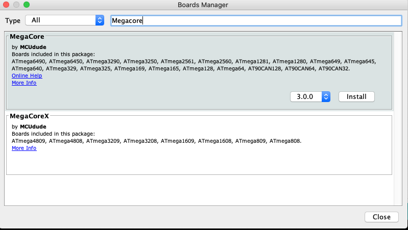
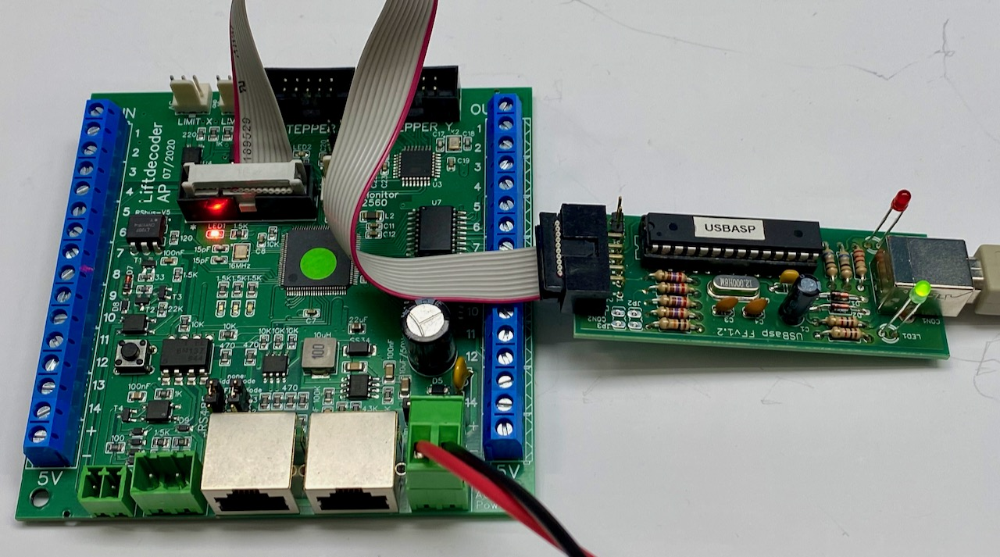
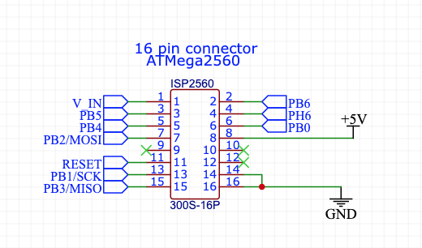

## MegaCore - Compile and upload ##

The goal of this step is to install the MegaCore board in the Arduino IDE (*this description uses Version 1.8.19 of the IDE, but Version 2 is similar*).

The Lift Decoder software relies on various definitions and functions that are not available within the default Arduino environment, but are provided by MegaCore. Therefore we must install MegaCore first. For details regarding MegaCore, see: *[https://github.com/MCUdude/MegaCore](https://github.com/MCUdude/MegaCore)*. Installing megaCore requires a number of steps.

First, ensure that the Arduino IDE can find the MegaCore board. Therefore you have to start the Arduino IDE and open **Preferences** and click **Additional Boards Manager URLs**. Add: **https://mcudude.github.io/MegaCore/package_MCUdude_MegaCore_index.json**. The result will be something like below:

Second, install the MegaCore board. Go to **Tools/Board/Board Manager**.

In the window that opens, type **Megacore**. 

### Blink sketch ###
Next we will check if everything is working, by installing the blink test sketch. Therefore open the Blink sketch (File => Examples => 01.Basics). The end result should be a blinking LED.

Although the board makes UART0 available as monitoring port, which can be connected to a development system via a serial to usb adapter, in general we won't be able to use such adapter to upload new code. The main reason is that bootloaders require a RESET before they start uploading new code. For this to happen the DTR signal of a serial adapter should be connected to the board's reset pin. Most adapters don't export such DTR signal, however.

Therefore uploading of sketches has to be done using an external programmer, such as USBasp. This programmer has been developed by [Thomas Fischl](https://www.fischl.de/usbasp/), and can be bought at various places. Alternatively it is also possible to use a [second Arduino as programmer](https://docs.arduino.cc/built-in-examples/arduino-isp/ArduinoISP).

The programmer must be connected to the 16 pin ISP connector on the decoder board. See the figure below. 

 The figure above shows how the pins of the 16-pin connector are wired. For programming, only the pins 7 till 16 are used.

Before we can upload any sketch, we need to initialize the fuse bits. This can be done by selecting in the Arduino IDE **Tools/Burn Bootloader**. This command may look a bit misleading, since if we don't select a bootloader, only the fuse bits will be set. Setting the fuse bits is needed only once, when the processor gets programmed first.

Alternatively we may also use the development system's command line to issue the following command (assuming usbasp): **avrdude -c usbasp -p m2560 -U lfuse:w:0xEE:m -U hfuse:w:0xD9:m -U efuse:w:0xFE:m**.

### Compile and upload sketch ###
To compile and upload a sketch, select the MegaCore board, the ATmega 2560 processor, MEGA pinout, and "no bootloader"; for the other settings see below. Select the programmer you have. Upload the sketch (**Upload** button or **Sketch => Using Programmer**).

