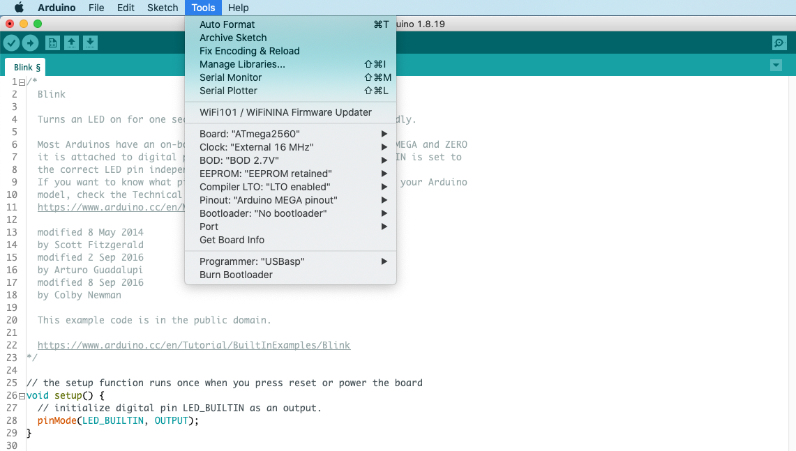

## MegaCore - Compile and upload ##

To compile and upload a lift-decoder sketch, select the MegaCore board, the ATmega 2560 processor, MEGA pinout, and "no bootloader". For other settings see below. Select the programmer you have.  
Upload the sketch (**Upload** button or **Sketch => Using Programmer**).

### MegaCore ###
If the Fuses have not yet been set or the MegaCore board  installed, see the instructions [here](./02-MegaCore-Compilation/Step02-02-MegaCore-Compilation.md)
