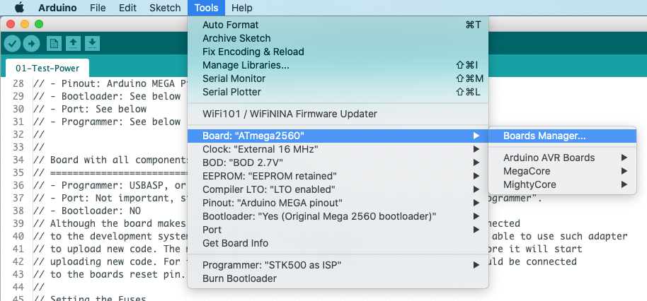
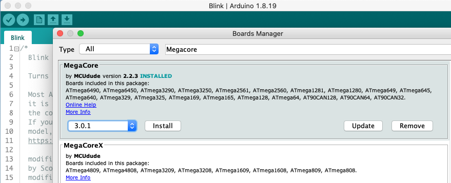
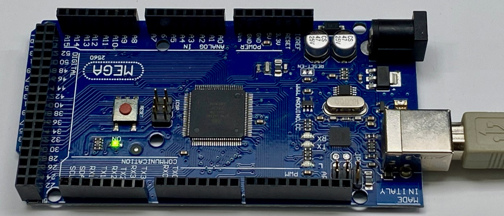

## MegaCore - Compile and upload ##

The goal of this step is to install the MegaCore board in the Arduino IDE (*this description uses Version 1.8.19 of the IDE, but Version 2 is similar*).

The Lift Decoder software relies on various definitions and functions that are not available within the default Arduino environment, but are provided by MegaCore. Therefore we must install MegaCore first. For details regarding MegaCore, see: *[https://github.com/MCUdude/MegaCore](https://github.com/MCUdude/MegaCore)*. Installing megaCore requires a number of steps.

First, ensure that the Arduino IDE can find the MegaCore board. Therefore you have to start the Arduino IDE and open **Preferences** and click **Additional Boards Manager URLs**. Add: **https://mcudude.github.io/MegaCore/package_MCUdude_MegaCore_index.json**. The result will be something like below: 

Second, install the MegaCore board. Go to **Tools/Board/Board Manager**.

In the window that opens, type **Megacore**. 

**Note:** Be sure to install V3.0.1 or higher (V3.0.0 of the MegaCore board lacked support for the original Arduino Mega bootloader).

### Blink sketch ###
Next we will check if everything is working, by installing the blink test sketch. Therefore open the Blink sketch (File => Examples => 01.Basics). The end result should be a blinking LED.

Connect a USB cable to the Arduino Mega boards 

### Compile and upload sketch ###
To compile and upload a sketch, select the MegaCore board, the ATmega 2560 processor and as Programmer the "Legacy Arduino MEGA bootloader". See below for the other settings. Upload the sketch (**Upload** button).

