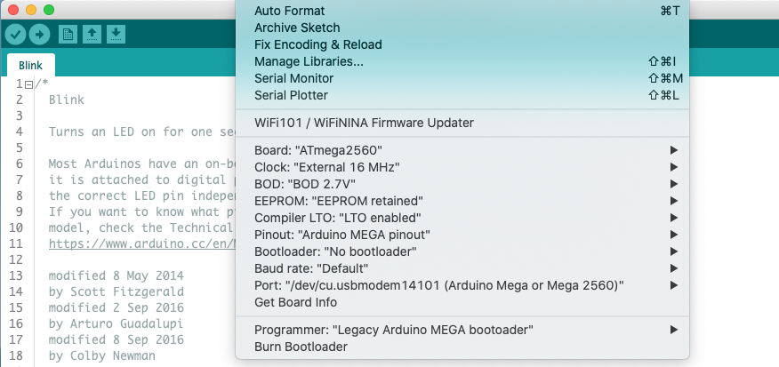

## MegaCore - Compile and upload ##

To compile and upload a lift-decoder sketch, select the MegaCore board, the ATmega 2560 processor and as Programmer the "Legacy Arduino MEGA bootloader". See below for the other settings.  
Upload the sketch (**Upload** button).

### MegaCore ###
If the MegaCore board has not yet been installed, see the instructions [here](/02-MegaCore-Compilation/Step02-MegaCore-Compilation.md)
