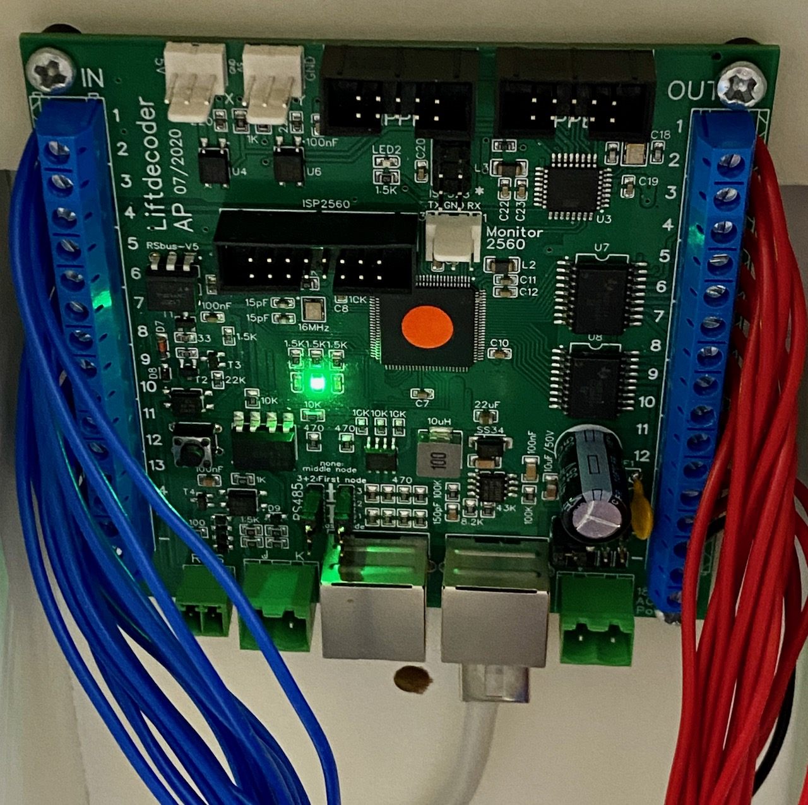

# <a name="Buttons controller"></a>Buttons controller #

This is the software for the Buttons controller.
The software has been tested on the following lift decoder boards:
  - SMD board: https://oshwlab.com/aikopras/support-lift-controller
  - THT board: https://oshwlab.com/aikopras/lift-decoder-arduino-mega-tht

Instructions for compiling can be found on:
  - SMD board: https://github.com/aikopras/Lift_Vitrine/blob/main/extras/Board-SMD/Compile.md
  - THT board: https://github.com/aikopras/Lift_Vitrine/blob/main/extras/Board-THT/Compile.md


### LEDs ###
**Blue LED:** The blue LED blinks whenever a RS485 request message is received from the main Lift decoder. The main Lift controller polls the Buttons controller every 100ms if a button is pushed. In normal operation the blue LED should therefore blink 10 times per second.

**Green LED:** The green LED indicates the board is powered and the sketch is started.

**Yellow LED:** The yellow LED is set immediately after a button is pushed. It stays on, until an explicit command is received from the Main Lift Controller, saying that the action associated with the button is completed.

**Red LED:** The red LED is not used by the Buttons Controller software.


### Wiring ###
The board has 14 inputs (`IN 1..14`) and 14 outputs (`OUT 1..14`). The outputs are used for the LEDs that are build into each and every button.
The buttons for the various levels should be wired to the `IN 1..11`pins; the Reset button to `IN 12`, and the UP and DOWN buttons to `IN 12` resp. `IN 13`. The other side of the buttons should be connected to `GND`. The LEDs, however, should be connected between the `OUT` pins and` +5V`.

In case you want to make changes, the meaning of the various pins is not defined in the button controller sketch, but in  [rs485.h](../Lift_Main/rs485.h) of the main controller sketch.
<center></center>


## Initialization ##
Before the Buttons-controller can be used, the following setting must be made first in the file [mySettings.h](mySettings.h).

##### 1) Tell the sketch which board will be used #####
As mentioned at the top of this page, the lift controller code has been tested on a SMD and a THT board. Although the decoder software will also run on other boards, it is important that the processor is an ATMega 2560 and that the correct connections are made between the processor pins and the various peripherals. Some of these assignments are made in the file [hardware.h](hardware.h) (the DCC, RSBus and RS485 assignments are made by their respective libraries). As can be seen in that file, some small differences exists between the pin assignments for both boards. The reason behind these differences, is that the SMD board  was developed first, and some pins were used that are not available on standard Arduino MEGA boards. Later the THT board was developed, which made some pin changes necessary. The choice between both boards is made via a `#define`.

To use the SMD board, enable the associated `#define`.
```
    #define BOARD_SMD
```
For the THT board, enable the other `#define`:
```
    #define BOARD_THT
```
