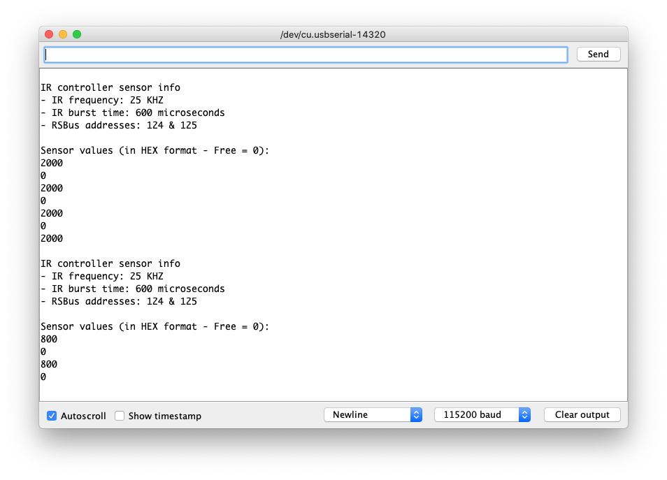
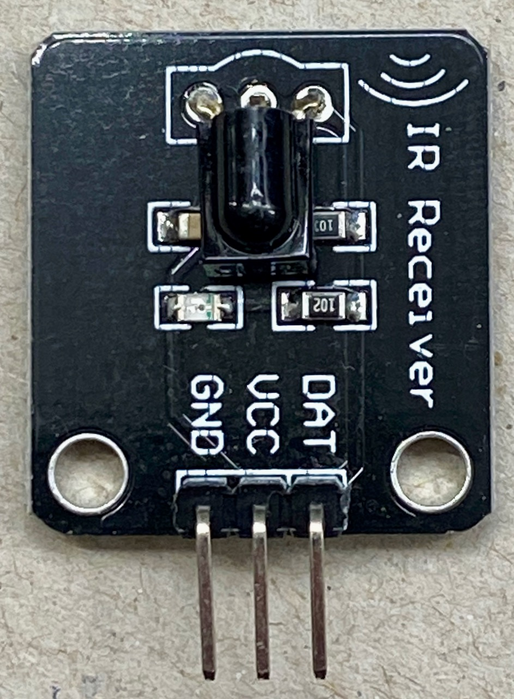
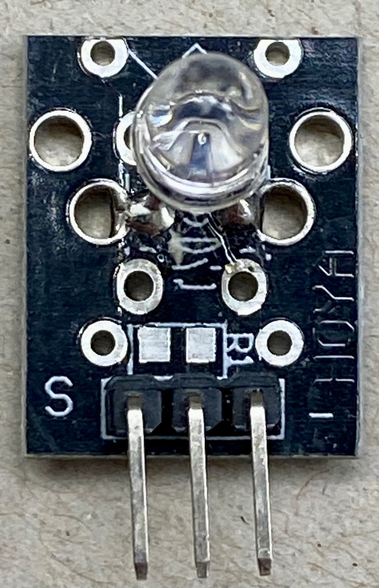
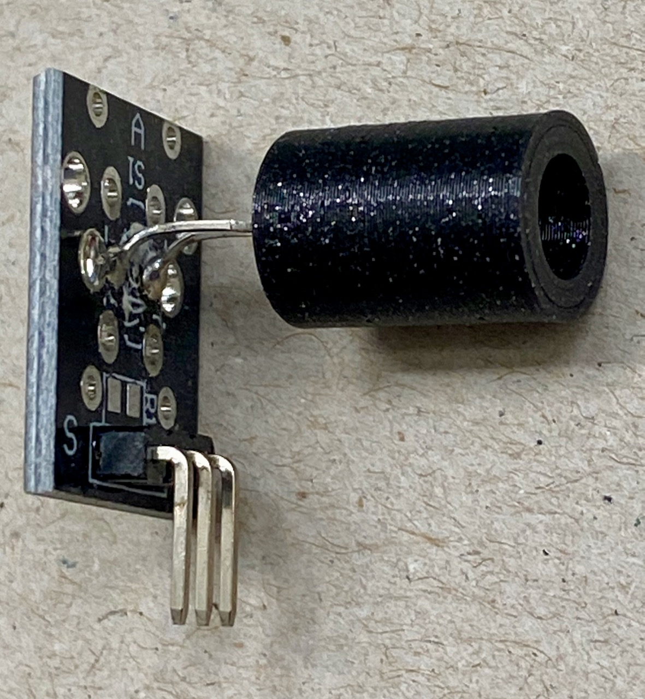

# <a name="IR controller"></a>IR-sensor controller #

This is the software for the Infra-Red (IR) sensor controller.
The software has been tested on the following lift decoder boards:
  - SMD board: https://oshwlab.com/aikopras/support-lift-controller
  - THT board: https://oshwlab.com/aikopras/lift-decoder-arduino-mega-tht

Instructions for compiling can be found on:
  - SMD board: https://github.com/aikopras/Lift_Vitrine/blob/main/extras/Board-SMD/Compile.md
  - THT board: https://github.com/aikopras/Lift_Vitrine/blob/main/extras/Board-THT/Compile.md

### LEDs ###
**Blue LED:** The blue LED blinks whenever a RS485 request message is received from the main Lift decoder. The main Lift controller polls the IR-controller every 100ms for the status of all IR sensors. In normal operation the blue LED should therefore blink 10 times per second.

**Green LED:** The green LED is on, as long as all IR-Sensors are free. At the moment a train blocks an IR-beam, the LED turns off. The IR-sensors are checked 10 times per second, thus changes will be detected within 100ms.

**Yellow LED:** In normal operations the yellow LED will be off. However, by pushing the onboard button, the decoder may be put in debugging mode (see below).

**Red LED:** The red LED blinks twice during startup, and once whenever a RSbus feedback message is send. Such feedback messages are send whenever a change in the status of one or more sensors is detected.

### Debugging mode ###
Debugging mode is entered, whenever the onboard button is pushed. If the button is pushed again, debugging mode will be turned off. The yellow LED indicates whether debugging mode is on or off.

In debugging mode, status information of every individual sensor is send over the Serial Interface and can thus be examined using the Arduino's Serial Monitor. Baudrate should be 115200 baud.

Sending data over the Serial Line is relatively CPU intensive and may sometimes interfere with normal operations. Therefore debugging mode should be off, unless you really need to check for errors.
<center></center>


## Sensors ##
For my lift, I've used the following IR-LEDs and Sensors. They are quite inexpensive and can be obtained from sources such as Ali. A problem with these LEDs, is that light goes into many directions, potentially leading to reflections. Due to reflections, the sensor (receiver) may still receive IR-light, despite the fact that the direct beam is blocked by a train. Therefore, to focus the IR-beam a bit, a black tube has been put around the sides of the LED.

##### Connections: #####
  - Receiver: GND goes to the decoder's GND (-), VCC goes to the decoder's 5V; DAT goes to one of the 14 decoder's input pins.
  - IR-LED: S (pin left) goes via a resistor of 1 Kohm or higher to the decoder's 5V; - (pin right) goes to the corresponding decoder's output pin; the pin in the middle will not be connected. Note that the LED *must* be connected (via a resistor) between the output pin and ***+5V***, and not to the decoder's *GND (-)*. This is because the decoder uses ULN 2803 output drivers, which are either Low or Undefined.

<table><tr>
<td>  </td>
<td>  </td>
<td>  </td>
</tr></table>


## Initialization ##
Before the IR-controller can be used, a number of settings must be made first in the file [mySettings.h](mySettings.h).

##### 1) Tell the sketch which board will be used #####
As mentioned at the top of this page, the lift controller code has been tested on a SMD and a THT board. Although the decoder software will also run on other boards, it is important that the processor is an ATMega 2560 and that the correct connections are made between the processor pins and the various peripherals. Some of these assignments are made in the file [hardware.h](hardware.h) (the DCC, RSBus and RS485 assignments are made by their respective libraries). As can be seen in that file, some small differences exists between the pin assignments for both boards. The reason behind these differences, is that the SMD board  was developed first, and some pins were used that are not available on standard Arduino MEGA boards. Later the THT board was developed, which made some pin changes necessary. The choice between both boards is made via a `#define`.

To use the SMD board, enable the associated `#define`.
```
    #define BOARD_SMD
```
For the THT board, enable the other `#define`:
```
    #define BOARD_THT
```
##### 2) Tell the sketch which I/O ports are used for the sensors #####
The lift decoder boards have 14 general purpose in- and outputs. Therefore a maximum of 14 sensors (IR-LEDs and IR-Receivers) may be connected (the software would facilitate 16). To tell the software which inputs/outputs are wired, a bitmask `MASK_SENSORS_CONNECTED` is used. The lowest order (rightmost) bit in that mask corresponds to the IN/OUT pair of the blue connectors that are labelled 1. Below are some examples:
 - `0b0000000000000001` a single sensor is connected to IN/OUT 1
 - `0b0000000000000011` two sensors are connected to IN/OUT 1 and 2
 - `0b0000000000000010` a single sensor is connected to IN/OUT 2
 - `0b0000111111111111` twelve sensors are connected to IN/OUT 1..12
 - `0b0011111111111111` all 14 sensors are connected

Again a `#define` is used to set the bit mask. Below the default setting for twelve sensors connected to IN/OUT 1..12:
```
    #define MASK_SENSORS_CONNECTED 0b0000111111111111
```

##### 3) Set the sensor sensitivity #####
The sensitivity of the IR LEDs and receivers is best around 38kHz. Unfortunately, at 38kHz the system may become too sensitive, allowing reflections to generate false negatives. A false negative occurs whenever a train blocks the direct IR-beam between LED and receiver, but because of reflections the receiver still receives IR-signals and therefore fails to detect the train.

There are several means to limit the effect of reflections. First, the software checks a single LED-receiver pair at a time; the receiver therefore never receives a beam coming from a different LED. Second, a small tube around the LED (see photo above) will focus the beam into a smaller beam. Third, the resistor in series with the LED limits the current flowing through the LED, and thus the strength of the IR-beam. In my layout I've used resistors with a value of 1 kOhm, but in hindsight a higher value would have been a better choice.

Fortunately there are also other ways to limit sensitivity. IR-LEDs and receivers usually operate at 38kHz, but will also operate at lower (or higher) frequencies, although less sensitive. To decrease the sensitivity of the sensors, we can therefore lower the frequency to, for example, a value of 25kHz. Depending on your specific situation, you may have to experiment with this value to find the value that works best. Again we will use a `#define` for that.

Next to modifying the KHZ value, we may also play with the time the burst lasts. To avoid the receiver from saturation, the burst of IR pulses may not become too long. In practice, a reasonable value will be something between 15 to 30 pulses, which corresponds (roughly) to anything between 375 us (15 x 25) and 750 us.

Below are the default values for 25 kHz and 600 us burst time:
```
#define KHZ 25                       // Frequency at which we operate the IR system
#define BURST_TIME 600               // Time in us the burst will last
```

##### 4) Set the RS-Bus addresses #####
Although the Main Lift Controller board signals to the DCC system / control computer whether all IR-Sensors are free or not (using a single bit), it may sometimes be convenient to also know the status of each individual sensor. This is particularly true in case of possible errors.  To facilitate individual sensor feedback, we use the RS feedback bus. We need two RSBus addresses for that, to accommodate a maximum of 16 sensors (although the board supports "only" 14 sensors).

You may change the addresses to any value you like. In case you don't use RSBus feedback, you should still have the addresses configured, to avoid compile errors. Below are the default values (note that this time we do not use a `#define`, but `const uint8_t`):
```
const uint8_t RS_AddresLow = 124;     // 1.. 128
const uint8_t RS_AddresHigh = 125;    // 1.. 128
```

##### 5) Speed versus portability #####
To increase speed, we can use for the IR-beam generation two of the three General Purpose I/O Registers (GPIORs) that are available on a ATMega 2560.
```
    #define PORT GPIOR0                   // Fast, but may interfere with other libraries
    #define BITMASK GPIOR1                 
```
To use these GPIORs, we have to be certain however that they are not yet used elsewhere in the software. The AP-DCC-Library, for example, already uses GPIOR0 and GPIOR1. In cases where we know that we can't use these GPIORs, or in cases where we obtain strange errors, we can use `volatile uint8_t` variables instead. This makes the code run less efficient, but improves portability.

```
    volatile uint8_t PORT;              // Slow, but more portable
    volatile uint8_t BITMASK;
```
