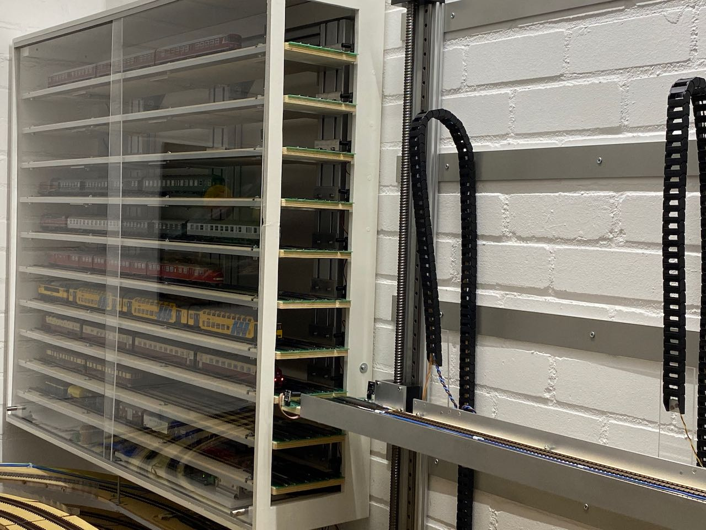
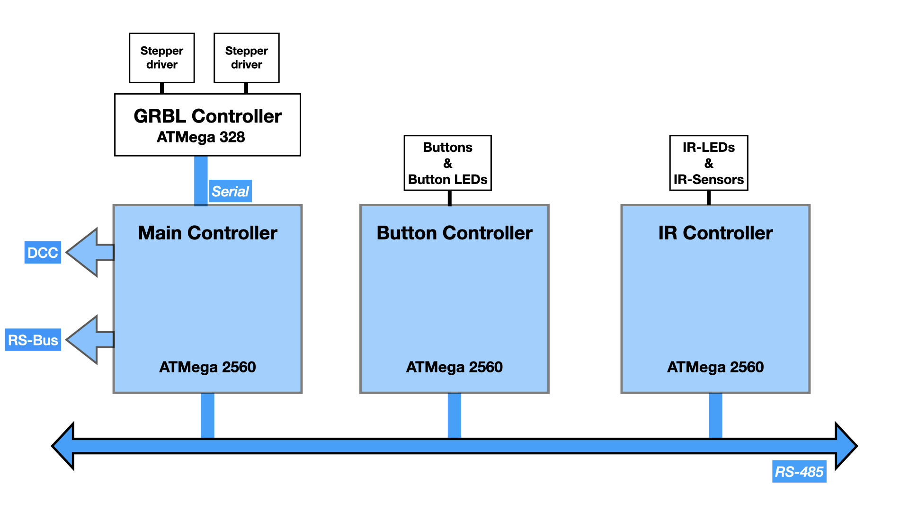
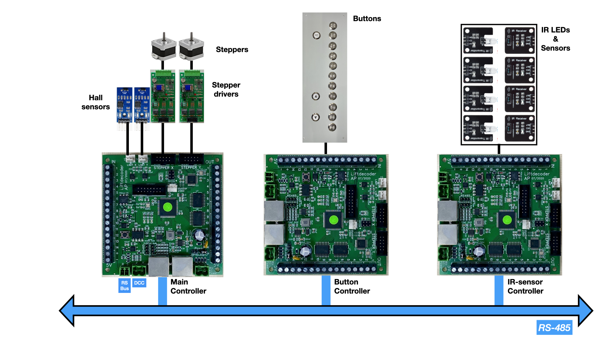
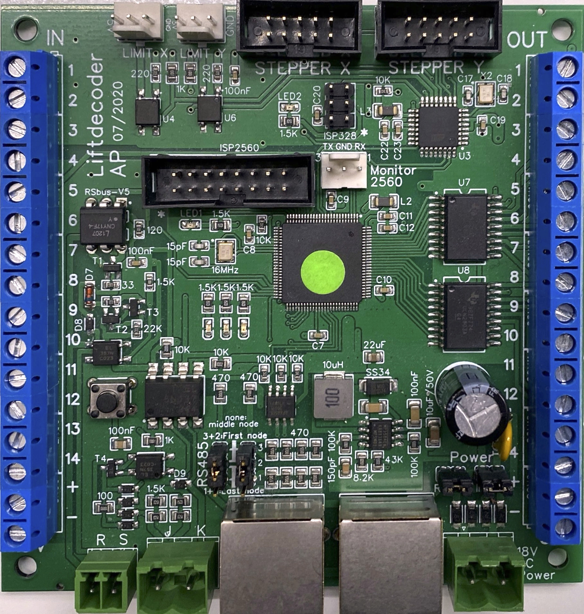

## Decoders and software for a model train lift (elevator, fiddle yard) ##

This software allows you to control a model train lift (elevator, fiddle yard). The photo below shows the lift at the right, and the display case (vitrine) at the left; if you click on the photo you'll see the lift in action (YouTube video; you may find there  [additional videos](https://youtube.com/playlist?list=PLT8t59Iv1uii5TKU-r4GmLXoBTifbTNtb)).

## Features ##
- Full open source (software as well as hardware).
- Can be used for up to 11 lift levels.
- The lift can be manually operated, using buttons, or by sending DCC accessory (switch) commands.
- [Full automatic operation possible](https://youtu.be/yOJ_Ovc0gCI?si=8jlIXjwKSL-hw6U0), by model train control software such as TrainController.
- Runs on ATMega 2560 processor.
- Two (open source) PCBs are available: a [SMD](https://oshwlab.com/aikopras/support-lift-controller) and a [THT](https://oshwlab.com/aikopras/lift-decoder-arduino-mega-tht) board.
- Provides feedback regarding the current lift position, as well as other status information (lift is moving, status IR-sensors)
- Feedback is provided via the (Lenz) RS-Bus. Interfacing with other feedback systems is possible, however.
- For extra safety: can be combined with IR-Sensors, to avoid lift movement if trains block the passage to/from the lift.
- For extra safety: relays can be connected to switch track power off if the lift is moving.
- Can control one or two stepper motors.
- Relies on GRBL to control the steppers motor, via a dedicated ATMega 328 / Arduino Nano.
- Allows homing, to guarantee exact positioning of the lift.
- For debugging purposes, a serial interface and / or LCD display can be connected.

## Overall structure ##
The system consists of three parts:
- **Main controller**: The main controller interfaces via the GRBL controller to the stepper drivers and motors that move the lift. The Main controller listens to DCC accessory as well as button controller commands that tell the lift to move to a certain position. The Main controller provides feedback information via the RS-Bus and its onboard connectors.
- **Button controller**: The Button controller connects to the buttons that allow manual movement of the lift. Buttons may include LEDs for visual feedback.
- **IR controller**: The IR-Sensor controller connects to the IR-LEDs and sensors that monitor if the passage to/from the lift is occupied by some train, or free.
- **RS-485**: The three controllers are connected to each other via the RS-485 bus.

A minimum system consists of a main controller only; in that case DCC switch commands will move the lift. If the button controller is attached as well, the lift may also be operated via the button interface. Note that, in such case, the lift can also be used without a DCC connection. Protection via the IR-Sensor controller enhances safety, but is optional.

## Hardware ##
Although the software runs on [standard Arduino boards](extras/Board-THT/Manual-Wiring.md), two boards were developed to make building and installation easier. Both boards are available as open source, and may be modified if desired.

#### THT Board ####
Since the software runs on standard Arduino boards, [a board that interconnects](https://oshwlab.com/aikopras/lift-decoder-arduino-mega-tht) the Arduino MEGA and NANO was developed. The board  includes a 5V power and RS485 module, which can both be bought from various (often Chinese) suppliers. The various components are all Through Hole Technology (THT), which are easy to solder. The red PCB at the bottom left side, is the RS-Bus interface, which is also open source board and available in [THT](https://oshwlab.com/aikopras/rs-bus-tht) and [SMD](https://oshwlab.com/aikopras/rs-bus-smd) versions.

The are [detailed instructions](extras/Board-THT/Assembly_Test.md) on how to compile and test software for this board.

#### SMD Board ####
In addition to the THT board, an open source [fully assembled SMD board](https://oshwlab.com/aikopras/support-lift-controller) was developed, that makes building even easier. In fact this board was developed first, after I discovered how cheap it was to order assembled boards in China. For five of these boards I paid in 2019 75 Euro in total. Unfortunately, component prices went up recently and now, January 2024, the costs for these five boards would be something between 125 and 150 Euro. Especially the 2560 processor has become, with 12$, quite expensive.

In September 2023 I noticed that the MP1584 Step-Down Converter is no longer *recommended for new designs*, and should be replaced by another component. That would be relatively simple change, however; on my newer boards I'm already using the TPS54331DR.

An alternative for a future board might be to replace the ATMega 2560 with one of the newer Microchip AVRs, such as an DxCore processor. In my new designs I'm using AVR32DA48 processors, which costs around 2,5$. Unfortunately replacing the chip would require, next to the board, also a redesign of some parts of the software.

The are [detailed instructions](extras/Board-SMD/Assembly_Test.md) on how to compile and test software for this board.

___

## References ##
- [Detailed instructions](extras/Board-THT/Assembly_Test.md) for compiling and testing software for the THT board
- [Detailed instructions](extras/Board-SMD/Assembly_Test.md) for compiling and testing software for the SMD board
- [Loklift controller videos](https://youtube.com/playlist?list=PLT8t59Iv1uii5TKU-r4GmLXoBTifbTNtb)
- [RS485 library for the Loklift decoders](https://github.com/aikopras/AP_RS485_for_Lift_decoders)
- [Discussion of the Loklift on Beneluxspoor forum (Dutch)](https://forum.beneluxspoor.net/index.php?topic=97091.0)
- [Discussion of the Loklift on Stummiforum (German)](https://www.stummiforum.de/t203419f15-Loklift-im-Eigenbau.html)
- [PCB for the THT board](https://oshwlab.com/aikopras/lift-decoder-arduino-mega-tht)
- [PCB for the SMD board](https://oshwlab.com/aikopras/support-lift-controller)
- [PCB for stepper drivers](https://oshwlab.com/aikopras/tmc2209-driver-board)
- [PCB for the DCC/RSbus shield](https://oshwlab.com/aikopras/arduino-uno-dcc-shield)
- [PCB for the RS-Bus (THT)](https://oshwlab.com/aikopras/rs-bus-tht)
- [PCB for the RS-Bus (SMD)](https://oshwlab.com/aikopras/rs-bus-smd)
- [PCB for the RSBus feedback decoders within the vitrine (show case)](https://oshwlab.com/aikopras/vitrine-decoder)
- [PCB to connect/align the three parallel tracks in the vitrine (show case)](https://oshwlab.com/aikopras/tracks-vitrine)
