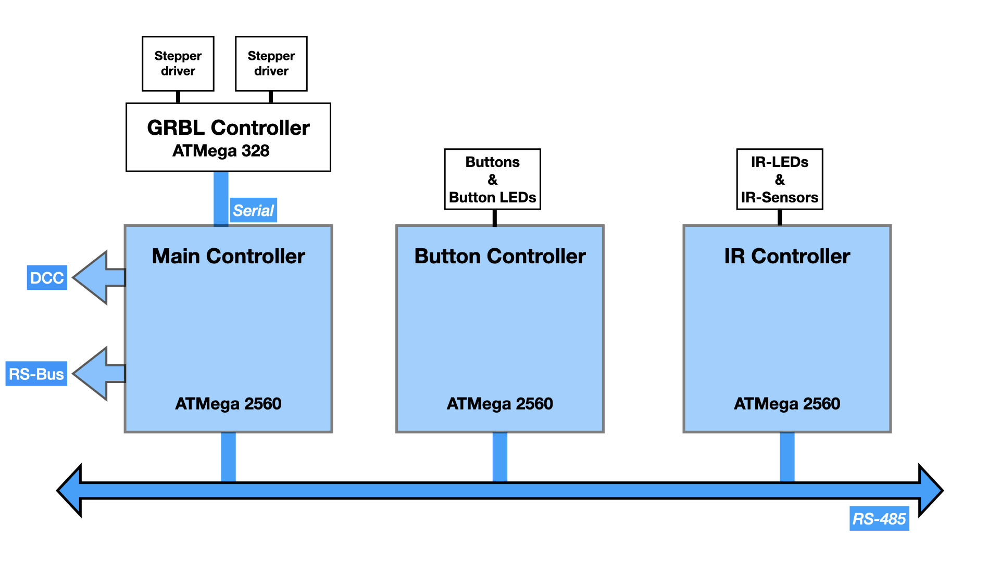
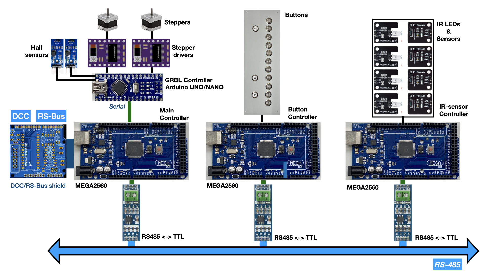
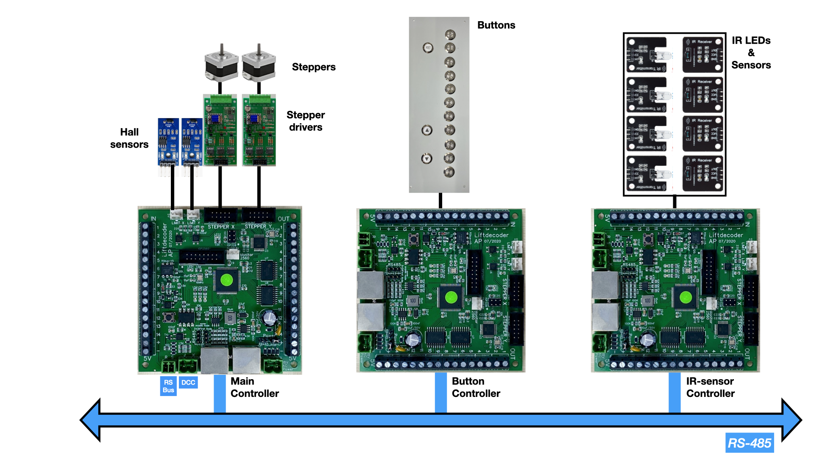

# Software for the Loklift decoders #

This is the software for the three (ATMega 2560) decoders that control the lift for model trains. The photo below shows the lift at the right, and the display case (vitrine) at the left. On [YouTube](https://youtube.com/playlist?list=PLT8t59Iv1uii5TKU-r4GmLXoBTifbTNtb) there are a couple of videos that show the lift in motion.

## Overall structure ##
The software consists of three parts:
- **Main controller**: The Main controller interfaces via the GRBL controller to the stepper motors that move the lift. The Main controller listens to DCC accessory commands that tell the lift to move to a certain level of the display case. The Main controller also sends RS-Bus feedback messages, to tell the current lift level whether the lift is moving, and if the IR-sensors, which monitor the passage between the lift and display case, indicate that no train blocks that passage. In addition (not shown in the figure below), the Main Controller listens to a serial interface to allow manual / debug operations, and connects to a LCD display that shows status information.
- **Button controller**: The Button controller connects to the buttons that allow manual movement of the lift.  
- **IR controller**: The Button controller connects to the IR-LEDs and sensors that monitor if the passage between lift and display case is occupied by some train, or free.

## RS-485 Interface ##
The three controllers are connected to each other via the RS-485 bus. To allow all three controllers to share the same RS-485 code, that code is packed as a dedicated library that must be separately downloaded and installed into your local Arduino library folder. For details, see [AP_RS485_Lift](https://github.com/aikopras/AP_RS485_for_Lift_decoders).

## Hardware ##
The software should be able to run on standard Arduino MEGA boards, as shown in the figure below. Compilation runs best if the board definitions provided by [MegaCore](https://github.com/MCUdude/MegaCore), are being used. Depending on how everything gets connected, it may be necessary to modify the `hardware.h` file that belongs to each decoder, to tell the compiler which Arduino in- and output pins are used for what.

The core component is the Main Controller, which talks to the GRBL controller and DCC / RS-Bus interfaces. For connecting these last interfaces, an option might be to use the [DCC and RS-Bus shield](https://oshwlab.com/aikopras/arduino-uno-dcc-shield). That shield includes all necessary DCC components, and allows connection of an [RS-Bus extension board](https://oshwlab.com/aikopras/rs-bus-tht).

The Main Controller should be connected via a serial (UART) interface to an Arduino UNO or NANO. This UNO or NANO board is responsible for driving the two stepper motors (via both stepper drivers, such as the DRV 8825 or TMC 2209), based on [GRBL](https://github.com/gnea/grbl/wiki). [GRBL software](https://github.com/gnea/grbl) should therefore be flashed on the UNO or NANO board; instructions are provided on the [GRBL Wiki](https://github.com/gnea/grbl/wiki/Flashing-Grbl-to-an-Arduino). The GRBL Controller should also be connected to two Hall sensors (one for each stepper), to allow determination of the precise start position (Homing). To make wiring of the stepper drivers easier, an option might be to mount a GRBL shield (also called CNC shield) on top of the Arduino UNO.

It is relatively easy to modify the Main Controller's software, such that it runs without the Button and/or IR-Sensor controller. In such cases the RS485-TTL converters can be omitted.

The Button Controller interfaces with (14) buttons that allow manual control of the lift. The buttons can be directly connected to the Arduino Mega (probably after modification of the `hardware.h` file). The buttons shown in the figure below have built-in LEDs, to show the currently active button. Although these LEDs may be (via a resistor) directly connected to the Mega board, it is better to drive the LEDs via a special (LED) driver ICs, such as the ULN 2803.

The purpose of the IR-sensor controller is to drive a number or IR-LEDs and sensors, to control of the passages between lift and show-case are free, or blocked by a train. The sensors can be directly connected to the Mega, but for the IR-LEDs it may be better to use (LED) driver ICs, such as the ULN 2803.

Depending on the number of buttons and levels, it might be possible to replace the boards for the Button and IR-sensor controllers by an Arduino UNO. The Main controller must be an Mega 2560, however, since that board should support multiple serial interfaces.

## Hardware, using dedicated Lift decoder boards ##
Although my original plan was to use the hardware as described above, my plans changed after I discovered how cheap it was to order assembled boards in China; for five boards I paid (in 2019) 75 Euro in total. Recently, component prices went up dramatically and now, september 2023, the costst for these five boards are something between 125 and 150 Euro. Especially the 2560 processor is, with 12$, still quite expensive. Companies like Mouser offer them for roughly 1/2 of the price, however, so lowering the costs might be possible using JLCPCB's option to use Global Sourced Parts. An alternative might be to replace the ATMega 2560 with one of the newer Mocrochip AVRs, such as an DxCore processor. In my new designs I use AVR32DA48 processors, which costs (again using Global Sourced Parts) around 2,5$. That would require a board and software redesign, however.

In September 2023 I noticed that the MP1584 Step-Down Converter is no longer recommended for new designs, and should be replaced by another component. That should be relatively simple; on my newer boards I'm already using the TPS54331DR.

The software has been optimised for the boards shown above. These boards can be copied from the [oshwlab](https://oshwlab.com/aikopras/support-lift-controller) and modified where needed. Board production and component assembly has been done by JLCPCB. For mounting the TMC 2209 stepper drivers, an [additional PCB](https://oshwlab.com/aikopras/tmc2209-driver-board) has been developed. The Hall sensor,  IR-LED and sensor boards are standard boards that can easily be bought online.

## Dependancies on other board definitions and libraries ##
The software for the lift decoders rely on some additional boards and libraries.
- The [MegaCore board definition](https://github.com/MCUdude/MegaCore): Arduino pin definitions, as provided by the MegaCore board, are used in the file [LiftMain/hardware.h](Lift_Main/hardware.h). These pin definitions are used, amongst others, for the coloured LEDs as can be found on the specific Lift decoder hardware board. These definitions may be easy to modify, however.
- The [AP_DCC_Decoder_Core library](https://github.com/aikopras/AP_DCC_Decoder_Core), which includes DCC packet decoding functions and access to the RS-Bus for feedback messages.
- The [AP_RS485_Lift](https://github.com/aikopras/AP_RS485_for_Lift_decoders), which provides the shared RS485 code that the various Lift decoders use.
- The [MoToTimer library](https://github.com/MicroBahner/MobaTools), which is part of the MoBaTools library.
- The LiquidCrystal library, which should already be available since it is an Arduino built-in library.
- The EEPROM library, which should already be available since it is an Arduino built-in library.

## Replacing RS-Bus feedback with Loconet, S88 or other feedback buses? ##
Since my train system relies on LENZ LZV-100 Master Stations, all my decoders use the Lenz RS-Bus for feedback messages. My core decoder library therefore relies on the [RSbus library](https://github.com/aikopras/RSbus). I assume that replacing my RSbus software with other feedback software may be relatively easy to implement, but I haven't tested it myself (and currently have no plans to develop and test that myself). Feel free to contact me in case you have plans yourself.

___

## References ##
- [Loklift controller videos](https://youtube.com/playlist?list=PLT8t59Iv1uii5TKU-r4GmLXoBTifbTNtb)
- [Loklift controller hardware](https://oshwlab.com/aikopras/support-lift-controller)
- [RS485 library for the Loklift decoders](https://github.com/aikopras/AP_RS485_for_Lift_decoders)
- [Discussion of the Loklift on Beneluxspoor forum (Dutch)](https://forum.beneluxspoor.net/index.php?topic=97091.0)
- [Discussion of the Loklift on Stummiforum (German)](https://www.stummiforum.de/t203419f15-Loklift-im-Eigenbau.html)
- [PCB for the lift decoders](https://oshwlab.com/aikopras/support-lift-controller)
- [PCB for the stepper drivers](https://oshwlab.com/aikopras/tmc2209-driver-board)
- [PCB for the DCC/RSbus shield](https://oshwlab.com/aikopras/arduino-uno-dcc-shield)
- [PCB for the RSBus feedback decoders within the vitrine (show case)](https://oshwlab.com/aikopras/vitrine-decoder)
- [PCB to connect/align the three parallel tracks in the vitrine (show case)](https://oshwlab.com/aikopras/tracks-vitrine)
