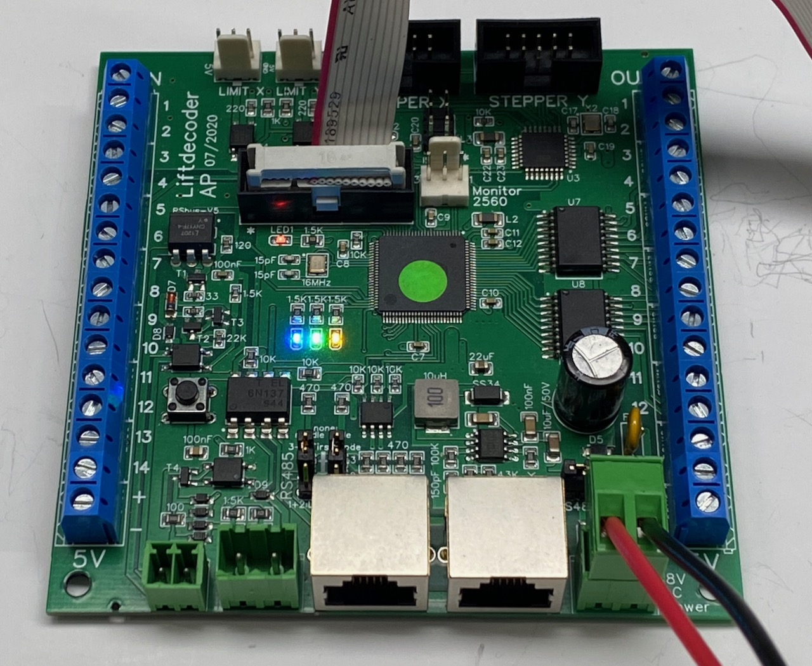

## Install and test the required Libraries

The goal of this step is to install and test all required libraries.

* AP_DCC_library: https://github.com/aikopras/AP_DCC_library 
This library contains all the code needed to decode the DCC signal. If you don't want to connect your lift decoder to a DCC system, you should still install this library.
* RSbus library: https://github.com/aikopras/RSbus 
This library contains all the code needed to send RS-Bus feedback signals. If you don't use the RS-Bus for feedback, you should still install this library.
* AP_RS485_Lift library: https://github.com/aikopras/AP_RS485_for_Lift_decoders 
A small library responsible for the communication between the various lift decoder boards. If you don't need the button and IR-sensor decoders, you should still install this library.
* AP_DCC_Decoder_Core library: https://github.com/aikopras/AP_DCC_Decoder_Core 
This library creates a decoder skeleton. It handles CV values and programming.
* MobaTools: https://github.com/MicroBahner/MobaTools 
From this library we only use the timers.

A description of how to install libraries see the related [Arduino documentation](https://docs.arduino.cc/software/ide-v1/tutorials/installing-libraries). Note that the AP_RS485_Lift and AP_DCC_Decoder_Core library must be manually downloaded from Github and installed at the right place in your Arduino Library folder. the other libraries can be found via the Arduino Library manager.

### The Test Libraries script ###
Open the sketch 03-Test-Libraries.ino (in the **Tests** folder). Compile and upload the sketch, using the settings as explained earlier in [Step02-Install-and-test-MegaCore.md](../02-Install-and-test-MegaCore/Step02-Install-and-test-MegaCore.md).

For the test to be successful, no compile errors may be raised, upload should work and all LEDs should blink, thus the red (onboard / DCC), blue, green and yellow LED. See the figure below. 

