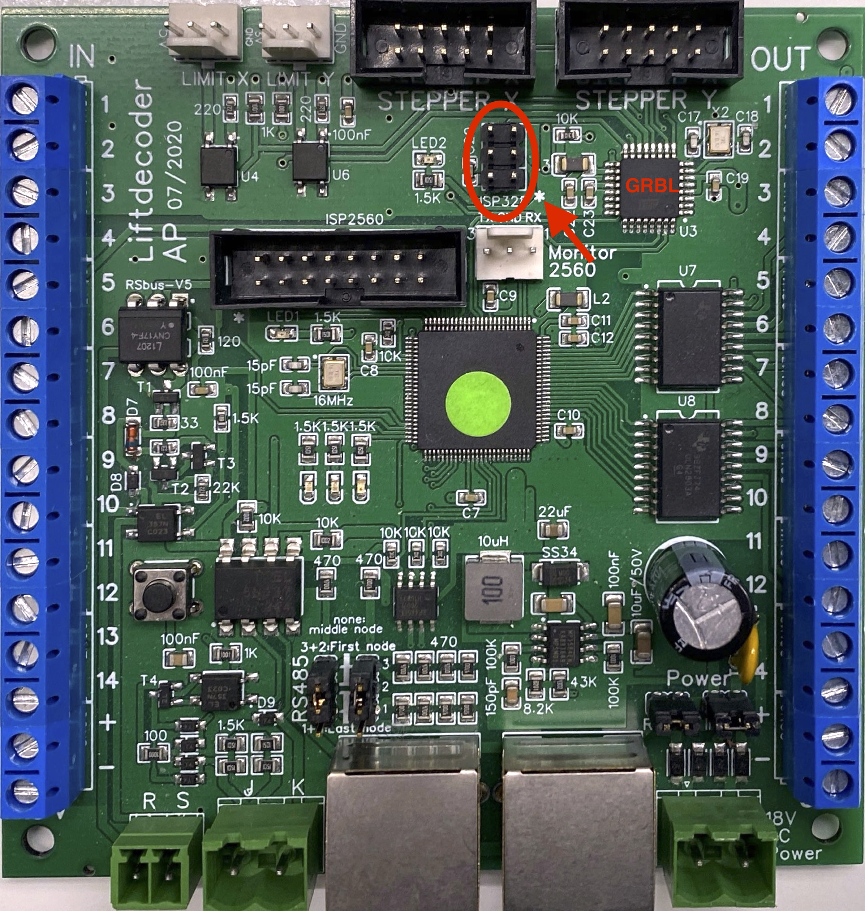
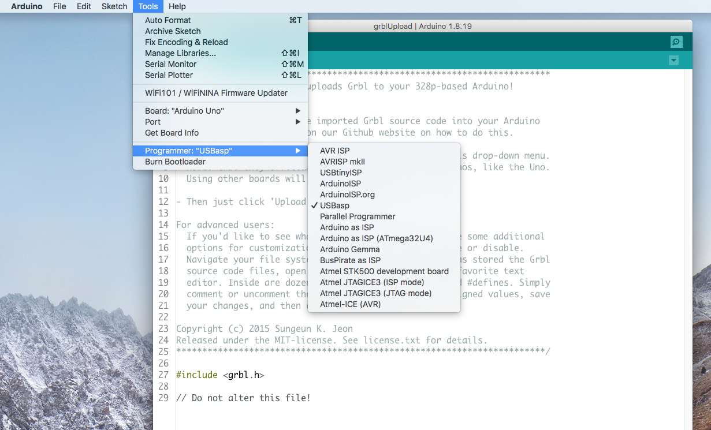
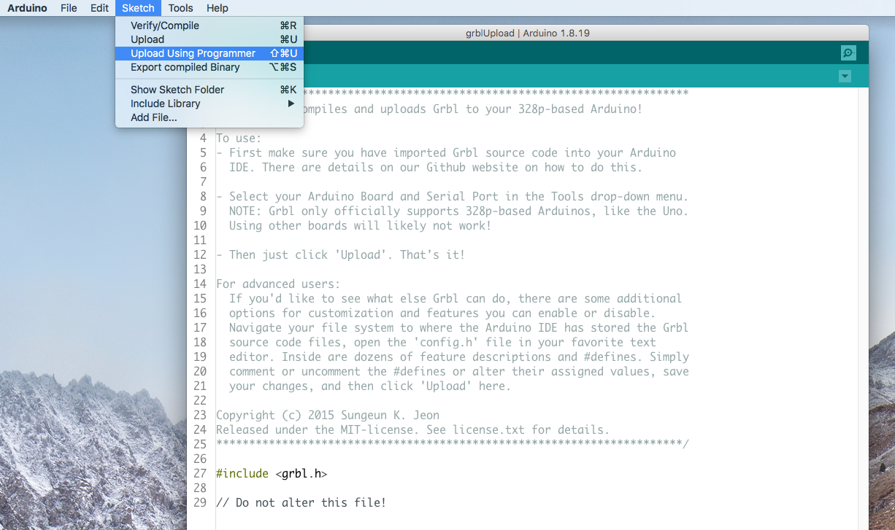
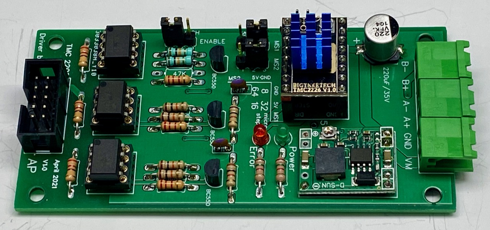
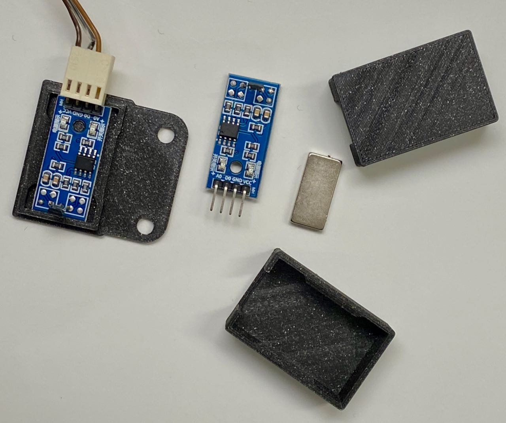

## Test the Stepper motors and Configure GRBL

The lift decoder board includes two processors: an ATMega 2560 for the main functions, and an ATMega 328 for GRBL.
The goal this step is to install and configure GRBL on the ATMega 328 processor.

### Prepare GRBL ###
Instructions on how to compile GRBL can be found on the [GRBL Wiki](https://github.com/gnea/grbl/wiki/Compiling-Grbl). 
Before compiling, a few changes may be required to the GRBL config.h file to ensure homing of the lift will operate as expected. Homing is generally needed to ensure that, after startup, the lift will be in a defined well-known position. 
The default GRBL homing sequence is to first home the Z-axis (HOMING_CYCLE_0) and after that the X- and Y-axis together (HOMING_CYCLE_1). Since we don't have a Z-axis, we need to edit the GRBL config.h file to disable Z-axis homing and, instead, do the X- and Y-axis in the first cycle  (HOMING_CYCLE_0). 
A second modification that is needed, is to change the origin, such that the lift operates in positive coordinate space. GRBL's default value is to operate into negative space, which seems to be typical for professional CNC machines. The code blocks below shows the changes I've made in GRBL's config.h file. 
First disable the default lines for homing.

    // Disable following three lines for Loklift
    // #define HOMING_CYCLE_0 (1<<Z_AXIS)                // REQUIRED: First move Z to clear workspace.
    // #define HOMING_CYCLE_1 ((1<<X_AXIS)|(1<<Y_AXIS))  // OPTIONAL: Then move X,Y at the same time.
    // #define HOMING_CYCLE_2                            // OPTIONAL: Uncomment and add axes mask to enable

Second, create the new line for homing. If you have two stepper (X and Y), add the following:

    #define HOMING_CYCLE_0 ((1<<X_AXIS)|(1<<Y_AXIS))  // Homes both X-Y in the first cycle.

If you have a single stepper (X), add the following:

    #define HOMING_CYCLE_0 (1<<X_AXIS)            // Homes X in the first cycle.

Finally, uncomment the following line to use positive coordinates:

    // Enable the following line for Loklift
    #define HOMING_FORCE_SET_ORIGIN // Uncomment to enable.

For completeness, the [new config.h file](GRBL_config/config.h) is included in the folder [GRBL_config](GRBL_config)

### Compile GRBL (v1.1) ###
After GRBL has been downloaded and the config.h file has been modified, GRBL can be compiled and uploaded to the ATMega 328 processor. Connect your programmer (such as USBasp) to the 6 pin connector called ISP328. Take care that the programmer's MISO pin (1) is connected to the pin that is marked (*). On the Arduino IDE, select as board "Arduino UNO", and as programmer "USBasp", or whatever programmer you have.
 

### Upload GRBL (v1.1) ###
To flash the GRBL code, select "Upload Using programmer". While programming, a small red LED on the decoder board will blink.

### Connect the stepper driver(s) and stepper motor(s) ###
You may use one or two Steppers, and connect them as Stepper X and / or Stepper Y.
An example of a good driver is the Makerbase MKS TMC2160. Alternatively you can use so-called StepStick drivers, such as the A4988, DRV8825, or the TMC2209 SilentStep Stick. Compared to the A4988 and DRV8825, the TMC2160 and 2209 make considerable less noise. If you prefer the StepStick drivers, you could consider the [opto-decoupled TMC 2209 driver board](https://oshwlab.com/aikopras/tmc2209-driver-board). The connector of that board is the same as used on the lift decoder board. On the Lift decoder board, connect the drivers to the connectors called STEPPER X (and STEPPER Y). The pins of these connectors follow the so-called [PMinMo 'standard'](http://www.massmind.org/techref/io/PMinMO.htm).

### Test the stepper(s) ###
Sending GRBL commands to test the stepper motor(s) can be done using the Serial monitor of the Arduino IDE. You therefore need a serial (USB) connection between your computer and the ATMega 328. However, the ATMega 328 processor on the lift decoder board has no USB connector attached to it. Therefore, we will send GRBL commands via the serial interface attached to the ATMega 2560 processor. For that purpose we need to install a simple sketch onto the ATMega 2560 processor, that mirrors all communications. Open the sketch [04-Configure_GRBL_and_test_steppers.ino](../../../Tests/04-Configure_GRBL_and_test_steppers/04-Configure_GRBL_and_test_steppers.ino) and upload it to the ATMega 2560 processor.

Use the Arduino "Serial Monitor" (or whatever program you have that supports serial communication) and set the baudrate to 115200. Test GRBL, by typing GRBL commands such as "?" and "$$". If you receive responses from GRBL, check next if the stepper motor is running, by using commands such as "X10" or X"0". See below for some of the main GRBL commands; a number of examples can be found in the file [GRBL-test-example.rtf](GRBL-test-example/GRBL-test-example.rtf):
- **?** - Status report query
- **X*value*** - Move the X stepper motor to *value*
- **X10 Y10** - Move the X and Y stepper motors to position 10mm
- **$$** - Display Grbl Settings
- **$H** - Run Homing Cycle
- **$X** - Cancel Alarm Lock state
- **Ctrl-x** - Soft Reset

### Configure the GRBL variables ###
The next, important step, is to configure the GRBL variables. If these variables are not configured well, the lift will most likely not operate as expected. A detailed description of these variable is provided on the [GRBL wiki](https://github.com/gnea/grbl/wiki/Grbl-v1.1-Configuration). Important variables that you most likely will have to change are **X/Y steps** ($100, $101), **X/Y Max rate** ($110, $111) as well as **X/Y Max travel**. Also **Direction invert** ($3) may have to be modified, if the lift moves in the opposite direction.

### Homing ###
The final big step in configuring GRBL, is **Homing**. Homing is needed to guarantee that, after the system has started, the lift moves to a well-defined position. The configuration variables relevant for Homing are: **Enable Homing** ($22=1), **Homing pull-off** ($27), the **Homing direction** ($23) and **Homing rate** ($24). Some additional details can be found on the GRBL wiki.

The picture above shows the (Chinese) Hall sensors and magnets I've used for homing. The picture also shows the holders that were 3D-printed to mount the Hall sensor and magnet. I've  [added the STL files](3D_Hall-sensor/) in case you want to print these yourself. The Hall sensor modules should be connected to the **Limit-X** and **Limit-Y** connectors on the lift decoder board. **VCC** should be connected to the pin labelled **5V**, **GND** to **GND** and **DO** to the connector's middle pin.
