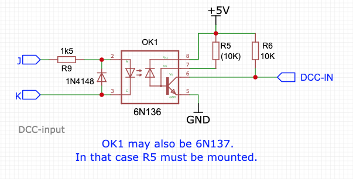
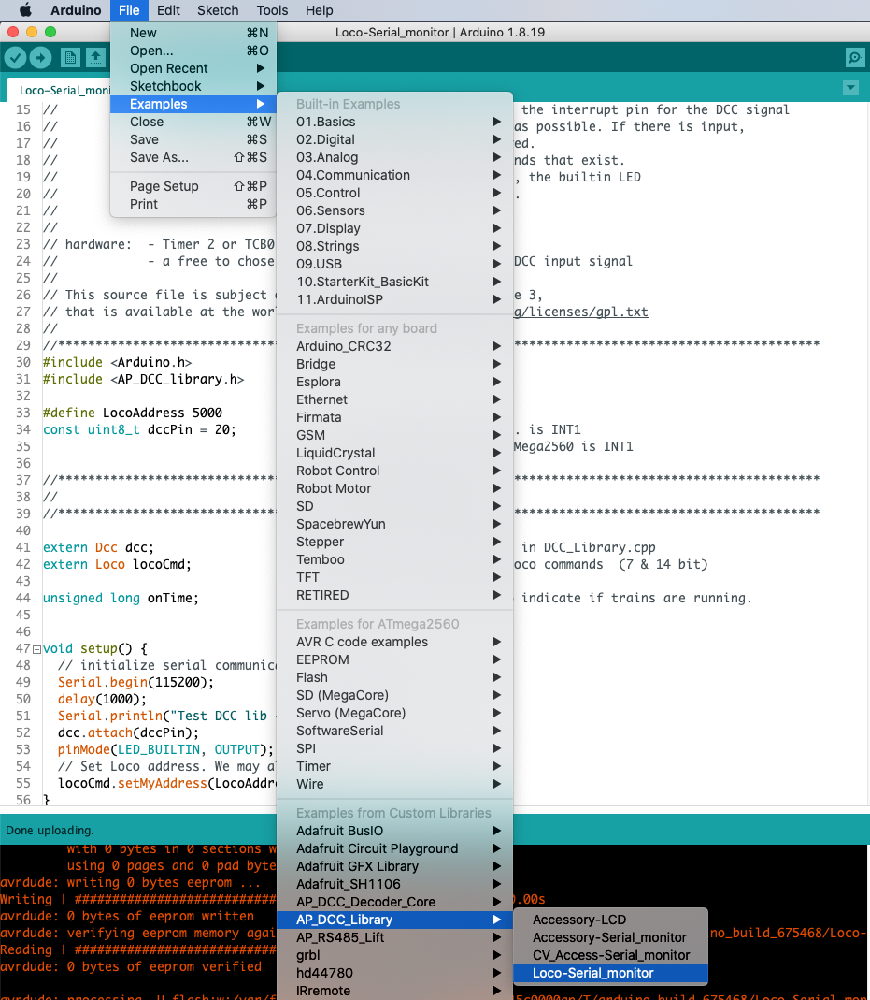
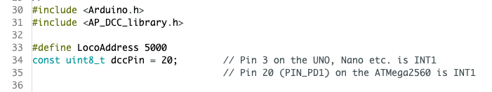
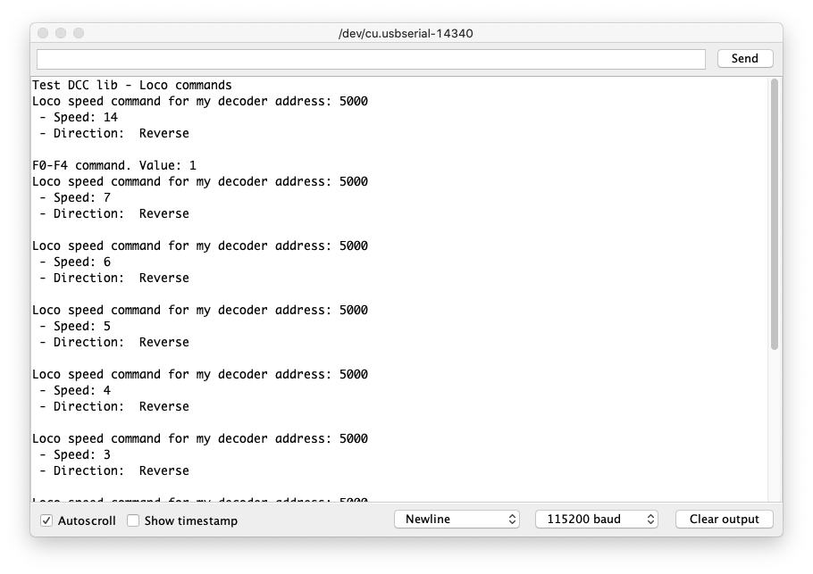

## DCC input ##

Next is testing that part of the board that is responsible for converting the DCC input signal into something that can be interpreted by the processor. If you don't want your lift to be controlled by DCC, you may skip this step.

The schematics of the DCC input part is shown in the figure below, and is quite standard for DCC decoding.

A description on how to test DCC input can be found in the examples section of the  [AP_DCC_library](https://github.com/aikopras/AP_DCC_library). Follow the instructions on that page to install the library, in case it has not yet been installed.

Open the Arduino IDE. Select File -> Examples -> AP_DCC_Library -> Loco-Serial-monitor (see figure below).

 
Select the DCC loco address you want to monitor and make sure you enter the right value for the dccPin that receives the DCC signal. For the Arduino ATMega 2560 processor, this must be Pin 20.

 

[Compile and upload the sketch](../Compile.md). Open the Arduino Serial Monitor, and use your handheld to make changes for this loco address. If things work well, you should see something like below.

