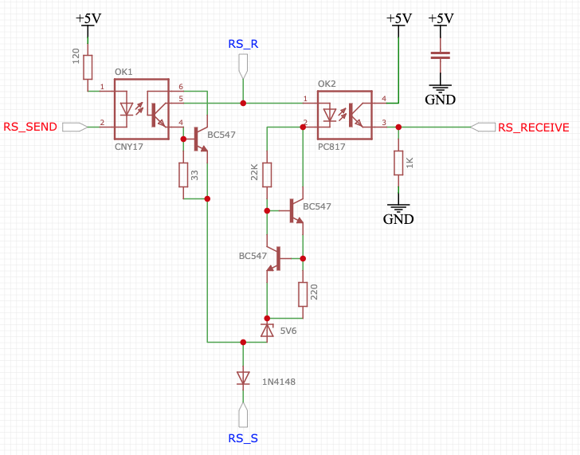
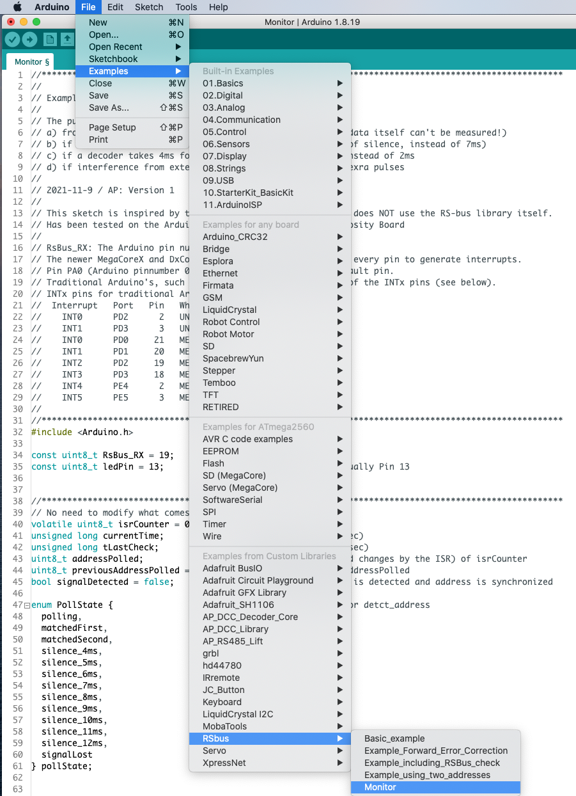
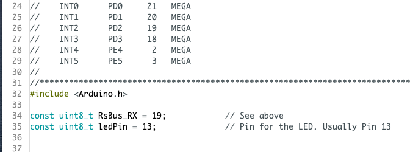
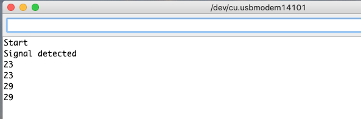

## RSBus ##

Next step is testing the RSbus feedback interface. If you don't want your boards to send RSbus feedback messages, you may skip this step.

The schematics of the RSbus is shown in the figure below, and was derived from the description on the [Der Moba](http://www.der-moba.de/index.php/RS-Rückmeldebus) website.

A description on how to test the RSbus can be found in the examples section of the  [RSbus library](https://github.com/aikopras/RSbus). Follow the instructions on that page to install the library, in case it has not yet been installed.

Open the Arduino IDE. Select File -> Examples -> RSbus -> Monitor (see figure below).

 
Make sure you enter the right value for the RsBus_RX pin that receives the RSbus signal. For the Arduino ATMega 2560 processor, this must be Pin 19.

 

[Compile and upload the sketch](../Compile.md). Open the Arduino Serial Monitor, and make  changes somewhere that trigger RSbus feedback messages. If things work well, you should see something like below.

