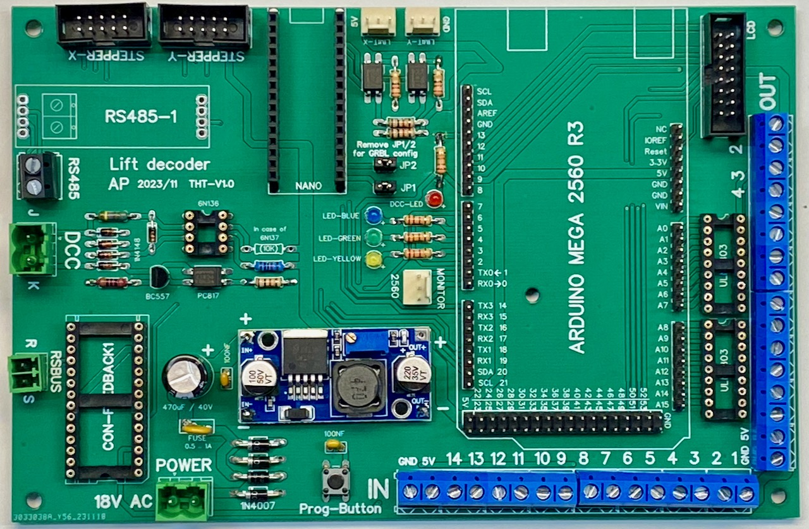
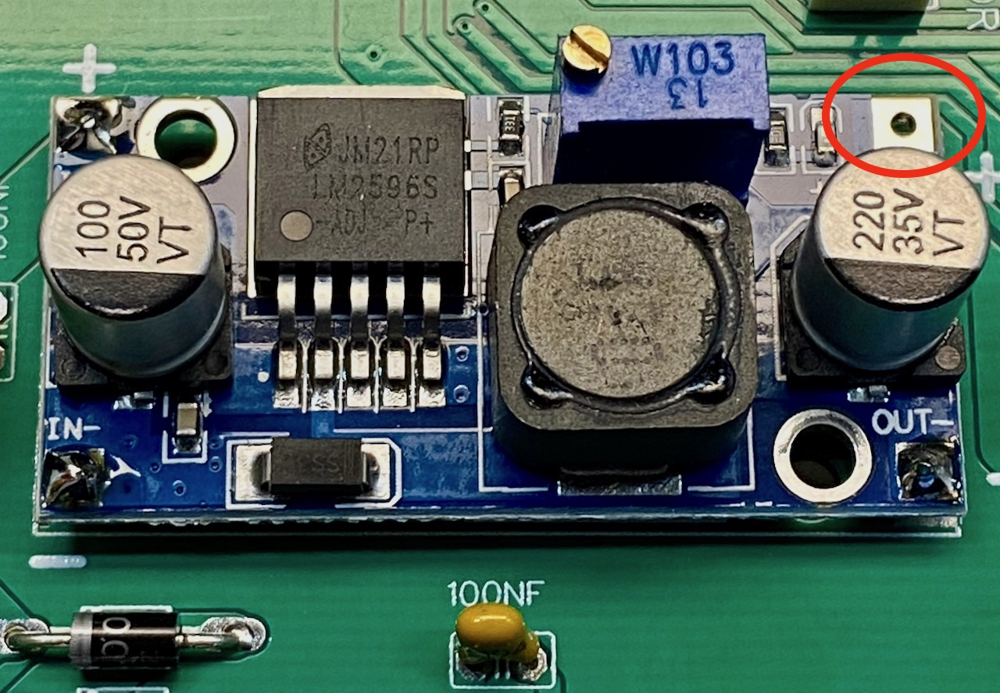
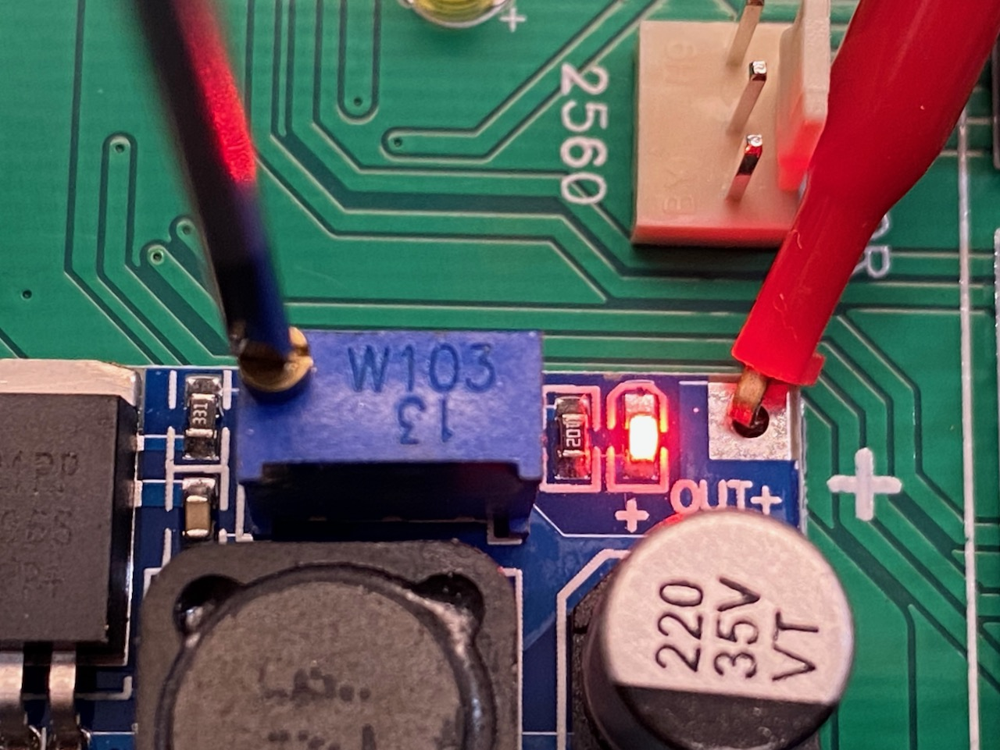
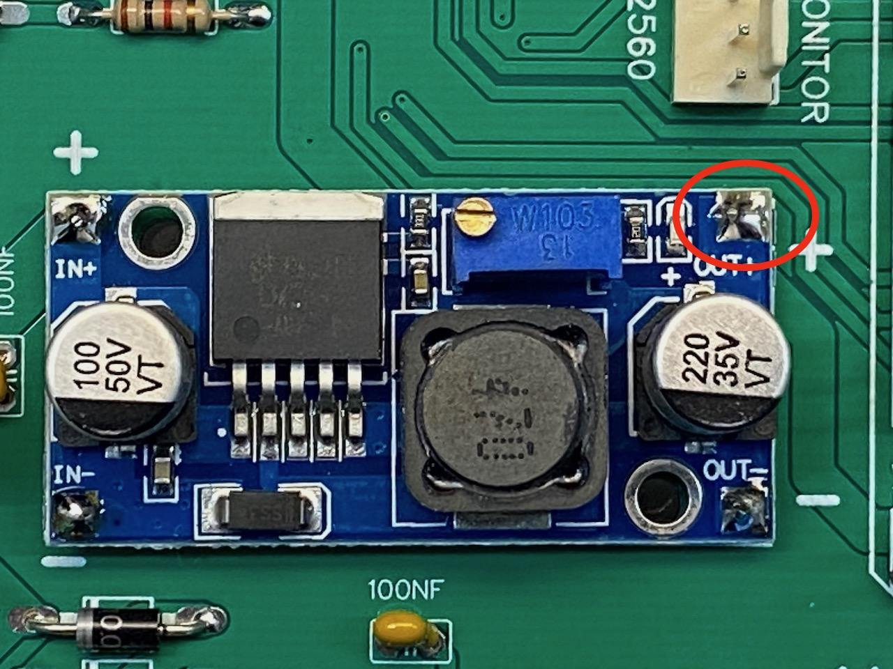
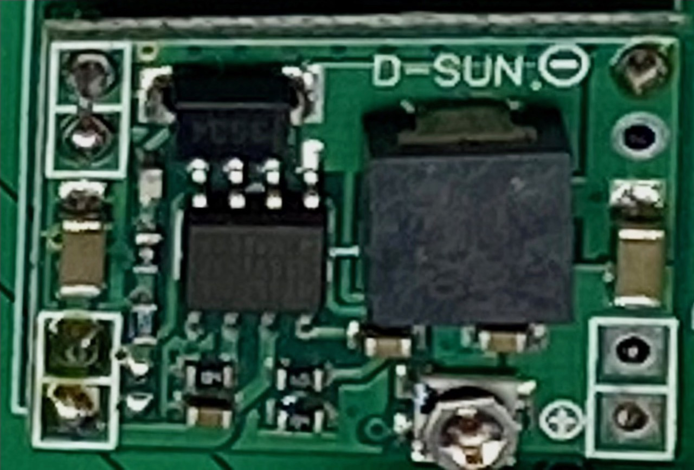

## Power the board

The goal of this step is to set the output of the step-down converter to 5 Volt. We do that *before* we connect the Arduino boards and RS485 module. 

To be safe, do not yet solder the **+5V OUT** yet to the remainder of the board. 

Next connect a power supply to the connector labelled **18V AC Power**. The power supply should deliver anything between 8 and 24V; a DC power supply should also work.

Next you must set the power to 5V. Connect a voltmeter to GND and the **+5V OUT**. 

Turn the screw on the potentiometer until the output power is exactly 5 Volt.  

Finally solder the **+5V OUT** to the remainder of the board. 

The power on any additional board should also be set to 5 Volt.

The layout of the print also supports 5V mini step-down converters that are based on a 1584 IC, such as shown below. 

