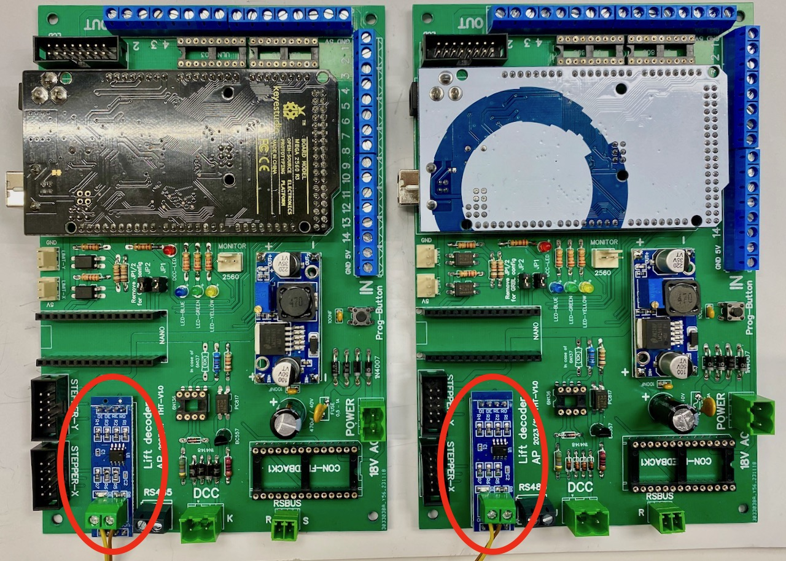

## RS485 ##

After GRBL has been installed and tested, the next step is to test the RS485 connection between the three boards (Main, Button and IR-Sensor.)

Installation and testing of the RS485 bus is described as part of the [AP_RS485_Lift library](https://github.com/aikopras/AP_RS485_for_Lift_decoders). Follow the instructions there.

First, test with two boards only: the RS485 master and a single slave. After that you can connect a second slave, and test if communication is still possible with three devices attached. Don't forget to modify the RS485 addresses for testing the second slave.

