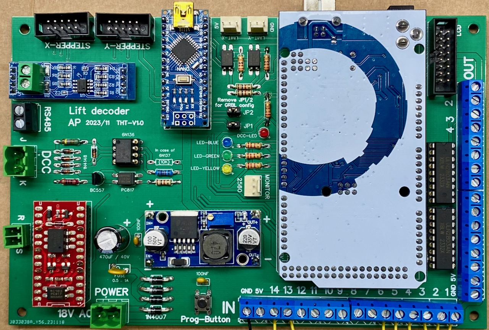

## Assembly and test (THT Board) ##

To make it relatively easy to built the Lift Decoder yourself, a number of instructions and test programs have been written. Assembly and tests is best performed in the following steps (click on each step to see detailed instructions):

  1. [Connect power and test if the power (step-down) electronics is working well](01-Power/Step01-Power.md)
  2. Within the Arduino IDE, install the MegaCore board. [Test compilation and upload of a simple sketch](02-MegaCore-Compilation/Step02-MegaCore-Compilation.md)
  3. Within the Arduino IDE, [install and test the various libraries that are needed](03-Install-and-test-Libraries/Step03-Install-and-test-Libraries.md)
  4. Connect the stepper motors, [configure GRBL and test homing](04-GRBL-and-steppers/Step04-GRBL-and-steppers.md)
  5. [Test if (RS485) communication between the boards is working](05-RS485/Step05-RS485.md)
  6. Optional: [Test if the DCC interface is working](06-DCC/Step06-DCC.md)
  7. Optional: [Test if the RS-Bus interface is working](07-RSBus/Step07-RSBus.md)
  8. Optional: [Install and test the button controller](../../Lift_Buttons/README.md)
  9. Optional: [Install and test the IR-Sensor controller](../../Lift_IR/README.md)
  10. [Install and test the main lift controller](../../Lift_Main/README.md)

