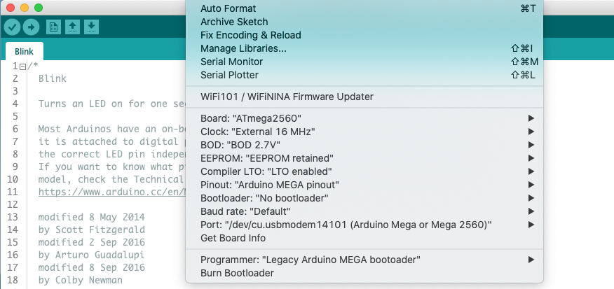

## MegaCore - Compile and upload ##

To compile and upload a lift-decoder sketch, select the MegaCore board, the ATmega 2560 processor and as Programmer the "Legacy Arduino MEGA bootloader". See below for the other settings.  
Upload the sketch (**Upload** button).

### MegaCore ###
If the MegaCore board has not yet been installed, see the instructions [here](./02-MegaCore-Compilation/Step02-MegaCore-Compilation.md)

### EEPROM retained? ###
The **Tools** menu includes an option called **EEPROM retained**. The idea behind this option is that, during compilation, a choice can be made whether the EEPROM should keep its current values, or be cleared / overwritten. Unfortunately, clearing / overwriting seems to be quite unreliable, and depend on several factors, including if / which bootloader is used. In practice the EEPROM will most likely *NOT* be cleared / overwritten.

The Lift decoder boards (and any board that uses the AP_DCC_Decoder_Core library) therefore check, at startup, if the EEPROM is empty (that happens if you use a new board). If that is the case, the EEPROM will be automatically filled with default values (from the [AP_DCC_Decoder_Core](https://github.com/aikopras/AP_DCC_Decoder_Core/blob/main/src/CvValues/CvValues.cpp) library).

In the setup() part of your sketch you may [override](https://github.com/aikopras/AP_DCC_Decoder_Core/blob/main/src/CvValues/CvValues.md) these initial CV values. To store these new CV values in EEPROM, you have to push the onboard button for 5 seconds (or use a PoM message and write to CV8).

The main lift decoder has, in the mySettings.h file, a compiler directive called FORCE_EEPROM_WRITE that will overwrite the EEPROM with new values. This directive can be used instead of the **EEPROM** retained" option in the **Tools** menu.
