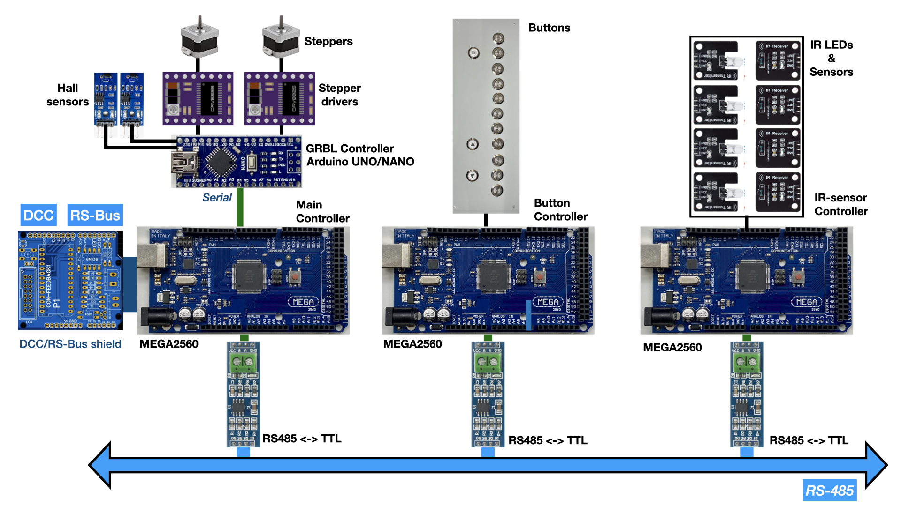
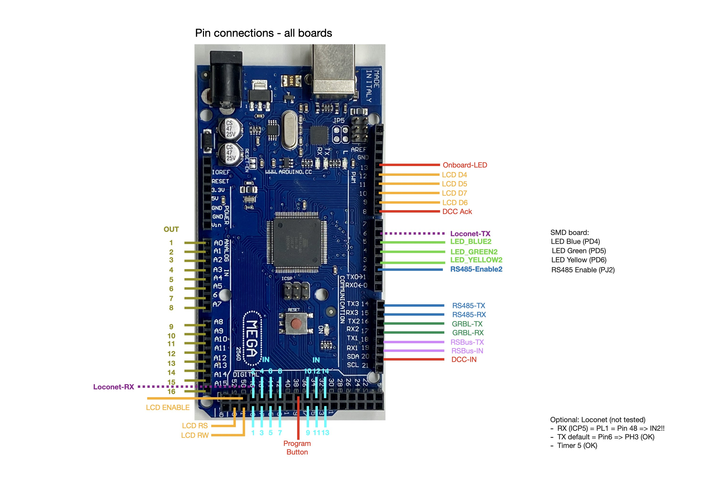
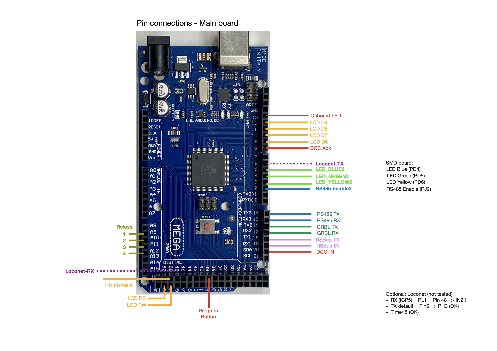

## Manual wiring ##

Although I wouldn't recommend this, in principle it is possible to run the software on standard Arduino boards that you interconnect yourself. The main controller *must* be an Arduino MEGA, since we need multiple serial interfaces (UARTS). Depending on the number of buttons and lift levels, it might be possible to replace the boards for the Button and IR-sensor controllers by an Arduino UNO or NANO. This requires a number of software changes, however (primarily differen pin definitions)

The main controller takes care of DCC and RS-Bus messages. For the DCC and RS-Bus interfaces an option would be to use the [DCC and RS-Bus shield](https://oshwlab.com/aikopras/arduino-uno-dcc-shield). That shield includes all necessary DCC components, and allows connection of an [RS-Bus extension board](https://oshwlab.com/aikopras/rs-bus-tht).

How the different wires should be connected to the MEGA board, is shown in the following two pictures. If you want, possible pins for a Loconet interface are shown as well. Note, however, that Loconet software is not included and therefore has not been tested.

